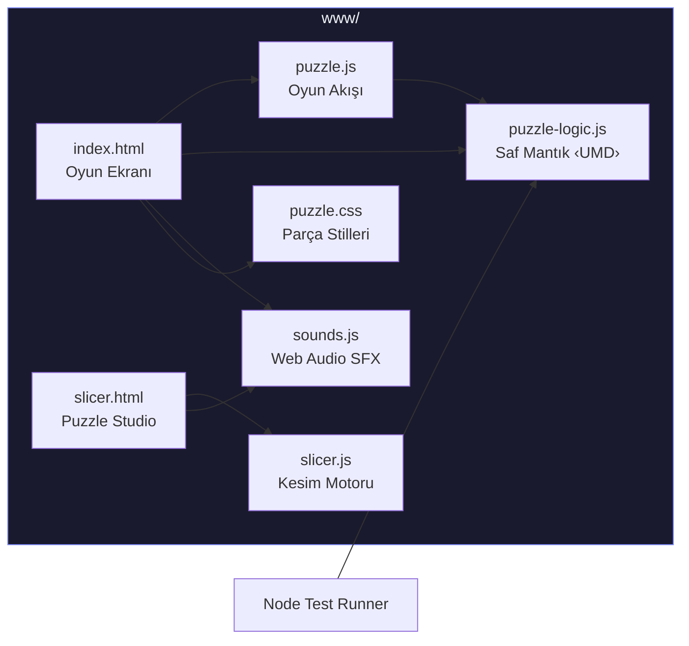

<p align="center">
  
</p>

<h1 align="center">🧩 ErtugrulsPuzzle</h1>

<p align="center">
  <strong>Yapboz oyna, yapboz tasarla — hepsi tek uygulamada.</strong>
</p>

<p align="center">
  
  
  
  
</p>

---

Apache Cordova ile geliştirilmiş, Android odaklı bir mobil yapboz uygulaması. İki temel ekranı var:
**Oyna** modunda klasik resim yapbozu çözersiniz. **Puzzle Studio** ile endüstri standartlarında
yapboz kesim desenleri tasarlayıp dışa aktarırsınız.

## ✨ Özellikler

### 🎮 Oyun Modu

| Özellik | Açıklama |
|---------|----------|
| **Resim Seçimi** | Hazır galeri görselleri + cihaz galerinden yükleme (JPG, PNG, WEBP) |
| **Zorluk Seviyeleri** | 3×3 🐣 · 4×4 😎 · 5×5 🔥 · 6×6 🏆 |
| **Oynanış** | İki parçaya dokun → yer değişsinler (animasyonlu swap) |
| **İstatistikler** | Gerçek zamanlı hamle sayacı + kronometre |
| **Kazanma Ekranı** | Konfeti animasyonu 🎉 + zafer melodisi + süre/hamle özeti |
| **Ses Efektleri** | Web Audio API ile sentetik sesler (harici dosya yok): seçim tıkı, takas swoosh, iptal boop, zafer melodisi |
| **Arayüz** | Premium dark glassmorphism tema, Inter fontu, yumuşak animasyonlar |

### 🎨 Puzzle Studio (Tasarla)

Ayrı bir sayfada (`slicer.html`) çalışan profesyonel yapboz deseni tasarım aracı:

- **Satır × Sütun**: 2 ile 20 arasında serbestçe ayarla
- **Boyut Presetleri**: 3×3, 5×5, 8×8, 12×12 hızlı seçim
- **9 adet kesim stratejisi** (aşağıda detaylı tablo)
- **Detaylı ayarlar** (gizlenebilir panel):
  - Topuz Derinliği · Düz Kısım Oranı · Eğrilik Miktarı · Organik Yumuşaklık · Topuz Genişliği
- **Kayıtlı Ayarlarım**: Mevcut parametre setini localStorage'da isimle kaydet / geri yükle / sil
- **Dışa Aktarma**:
  - 📥 Tam resmi PNG olarak indir
  - 🧩 Her parçayı ayrı ayrı PNG olarak indir
- **Canlı İstatistik**: Toplam parça sayısı + topuz varyasyon bilgisi

#### Kesim Stratejileri

| Strateji | Tip | Açıklama |
|----------|-----|----------|
| 📐 **Standart** | Temel | Orijinal 3-fazlı S-curve → knob → S-curve kenarları |
| 🧩 **Educa** | Temel | 4 farklı topuz tipi karışık (klasik, oval, düzensiz, çift topuz) |
| 📐 **Ribbon Cut** | Sektör | Düz, uniform, grid benzeri — küçük simetrik yarım daire topuz |
| 🎲 **Random Cut** | Sektör | Asimetrik, kaydırılmış topuz, yüksek varyasyon |
| 🔵 **Ravensburger** | Sektör | Temiz, hassas, "Softclick" uyumlu — yumuşak boyunlu derin topuz |
| 🏛️ **Victorian** | Sektör | El yapımı, dalgalı, organik kıvrımlar — tüm kenar boyunca dalgalar |
| 👶 **Strip Cut** | Sektör | Çocuk yapbozları — çok sığ, geniş, yuvarlak topuz |
| 🌊 **Flow Cut** | Sektör | Sanatsal — S-curve + akışkan derin topuz, akan dalgalar |
| ⚡ **Laser Cut** | Sektör | Keskin, açısal, geometrik — düz çizgiler + dikdörtgen topuz |

## 🏗️ Mimari



## 📂 Proje Yapısı

```
PuzzleApp/
├── www/                         # Uygulama arayüzü
│   ├── index.html               # Ana oyun ekranı (glassmorphism UI)
│   ├── slicer.html              # Puzzle Studio tasarım aracı
│   ├── puzzle.js                # Oyun akışı (hamle, timer, kazanma)
│   ├── puzzle-logic.js          # Saf mantık — UMD modül (test edilir)
│   ├── slicer.js                # 9 strateji ile kesim motoru (~800 satır)
│   ├── sounds.js                # Sentetik ses efektleri (Web Audio API)
│   ├── puzzle.css               # Yapboz parça stilleri + animasyonlar
│   └── img/
│       └── logo.png             # Varsayılan yapboz görseli
├── test/
│   └── puzzle-logic.test.js     # Birim testleri (Node test runner)
├── platforms/android/           # Android platform kaynakları
├── config.xml                   # Cordova yapılandırması
├── package.json                 # Proje metadata + bağımlılıklar
└── build.json                   # İmzalama/Build konfigürasyonu
```

## 🛠️ Teknoloji Yığını

| Katman | Teknoloji |
|--------|-----------|
| Framework | Apache Cordova + cordova-android `^14.0.1` |
| Dil | Vanilla JavaScript (ES6+), HTML5, CSS3 |
| Arayüz | Glassmorphism, Inter fontu, CSS animasyonlar |
| Ses | Web Audio API — tüm efektler sentetik, sıfır harici dosya |
| Çizim | HTML5 Canvas 2D (kesim desenleri + parça dışa aktarma) |
| Depolama | `localStorage` (özel preset kayıtları) |
| Test | Node.js `--test` runner (built-in) |

## 🚀 Hızlı Başlangıç

### Gereksinimler

- **Node.js** 20+
- **Java** 17+ (`JAVA_HOME` ayarlı)
- **Android SDK** (platform-tools + build-tools)
- **Cordova CLI**: `npm i -g cordova`

### Kurulum

```bash
git clone <repo-url>
cd PuzzleApp
npm install
```

### Testleri Çalıştırma

```bash
npm test
# → node --test test/puzzle-logic.test.js
```

### Android Emülatör / Cihazda Çalıştırma

```bash
cordova prepare android
cordova run android
```

### Debug APK Derleme

**Linux / macOS:**

```bash
cd platforms/android
./tools/gradlew assembleDebug
```

**Windows PowerShell:**

```powershell
cd platforms/android
.\tools\gradlew.bat assembleDebug
```

> APK çıktısı: `platforms/android/app/build/outputs/apk/debug/app-debug.apk`

### Tarayıcıda Test Etme

`www/index.html` veya `www/slicer.html` dosyasını doğrudan bir tarayıcıda açarak Cordova olmadan temel işlevleri test edebilirsiniz. Ses ve oyun mekaniği tarayıcıda da çalışır.

## ⚠️ Sorun Giderme

| Sorun | Çözüm |
|-------|-------|
| Hazır görseller yüklenmiyor | İki adet Unsplash görseli internet gerektirir. Offline isen galeriden resim yükle. |
| `cordova` komutu bulunamıyor | `npm i -g cordova` ile global kur. |
| Android SDK / JDK hatası | `JAVA_HOME` ve `ANDROID_HOME` ortam değişkenlerini kontrol et. |
| Ses çalışmıyor (mobil) | İlk ekran dokunuşu `AudioContext` kilidini açar — normal davranış. |
| Parçalar animasyonsuz | Tarayıcı `requestAnimationFrame` desteğini kontrol et. |

## 📝 Repo Notları

- `.tools/` klasörü `.gitignore`'da — büyük araç/artifact birikimini önler.
- Android build/cache dosyaları `platforms/android/.gitignore` ile dışlanır (`.gradle`, `*/build`, `local.properties`).
- `build.json` içinde imzalama ayarları var — **keystore dosyalarını repoya eklemeyin**.
- `puzzle-logic.js` UMD modül formatında: hem tarayıcıda (`window.PuzzleLogic`) hem Node.js'de (`require()`) çalışır.

## 📄 Lisans

Bu proje [Apache License 2.0](https://www.apache.org/licenses/LICENSE-2.0) ile lisanslanmıştır.
